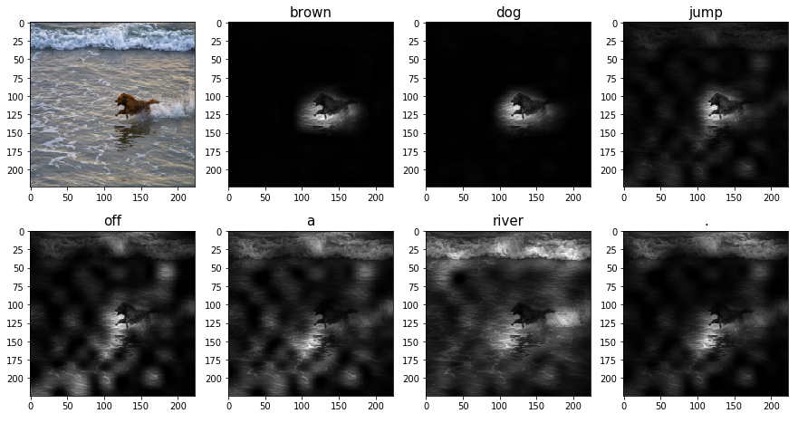
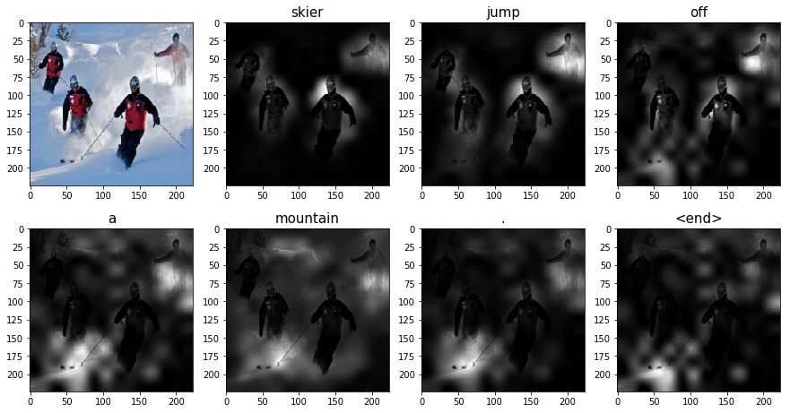
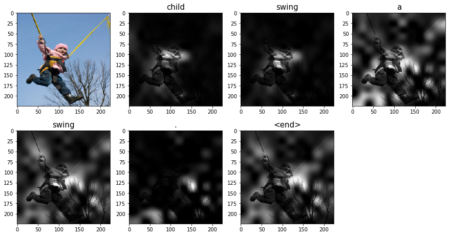
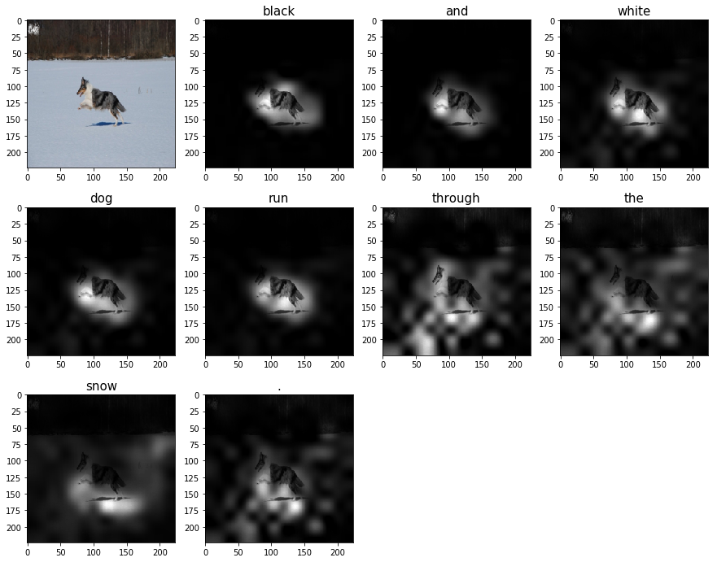
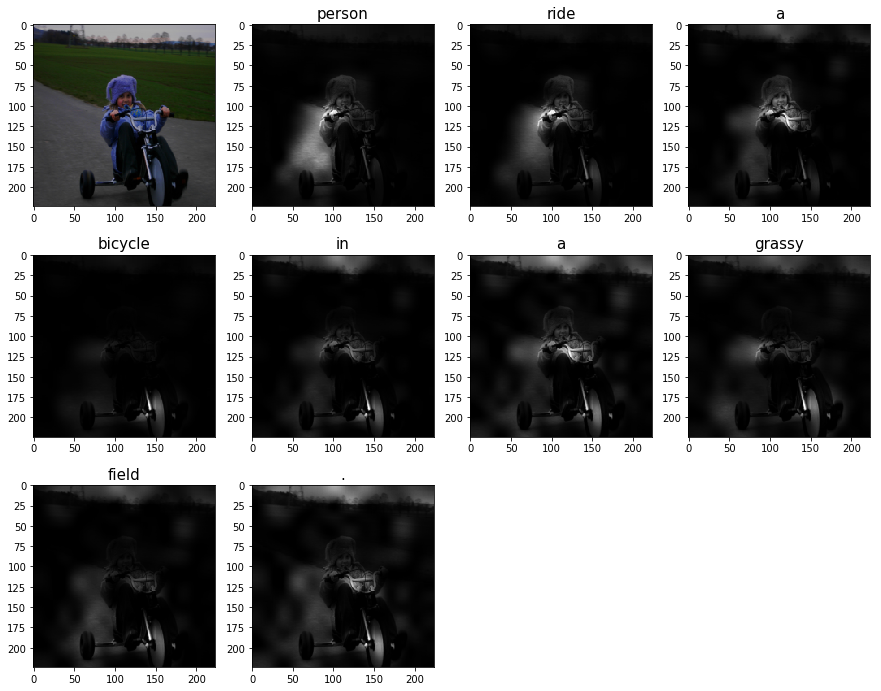

# Image caption with attention

This is a Pytorch implementation of "[Show, Attend and Tell: Neural Image Caption Generation with Visual Attention](http://arxiv.org/pdf/1502.03044.pdf)".

Some results:

